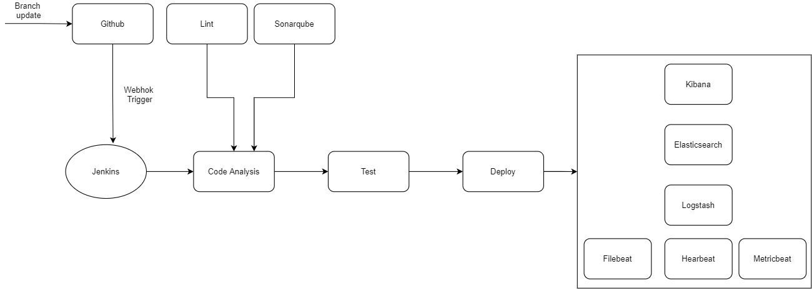

# ELK Stack Automation Design

Deploy ELK stack with Ansible Docker and monitor the Docker deployment itself.

Roles:
* docker - Checks if docker daemon is up and running
* elasticsearch - Deploys elasticsearch container
* kibana - Deploys Kibana container
* logstash - Deploys Logstash container
* heartbeat - Deploys uptime metric container
* metricbeat - Deploys container that collects host system metrics
* filebeat - Deploys container that forwards log files

## Requirement

The target Docker host requires the following packages:

* Docker
* Pip `sudo apt-get install python3-pip python3-docker`
* Passwordless sudo for ansible user

## Setup### Localhost

Deploying to localhost requires local ssh access.

Copy the public key.

`echo $SSHKEY >> ~/.ssh/authorized_keys`

Enable passwordless sudo login.

`sudo /bin/bash -c "echo \"$USERNAME  ALL=(ALL) NOPASSWD:ALL\" >> /etc/sudoers"`

Test ssh access.

`ssh $USERNAME@localhost`

## Deployment

Test connection

`ansible all -m ping -i inventory/ansible_hosts`

Deploy elk stack

`ansible-playbook -i inventory inventory/ansible_hosts elk.yml`

Deploy Specific role

`ansible-playbook -i inventory inventory/ansible_hosts elk.yml --tags logstash`

## Quality Analysis

Lint the project using Ansible lint.

`ansible-lint elk.yml`

### Architecture

List of connections:

External

* Logdrain → syslog://$HOSTNAME:5000 (!) this connection is not secured.
* Kibana dashboard → http://$HOSTNAME
* Elasticsearch → https://$HOSTNAME:9200
* Logstash beats → tcp://$HOSTNAME:5044 (!) this connection is not secured.

Kibana

* Elasticsearch → https://$HOSTNAME:9200

Kibana

* Kibana dashboard → http://$HOSTNAME:5601

Logstash

* Elasticearch → http://es01:9200

Heartbeat

* Logstash → tcp://$HOSTNAME:5044

Metricbeat

* Logstash → tcp://$HOSTNAME:5044

Filebeat

* Logstash → tcp://$HOSTNAME:5044